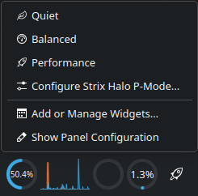
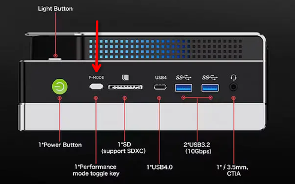

# Strix Halo Power

Switch the APU power mode (`quiet` / `balanced` / `performance`) on AMD
**Strix Halo** hardware (Ryzen AI Max+ 395, Sixunited AXB35-02 EC) — from a
physical button, a Plasma 6 panel widget, or the CLI. Everything survives a
reboot.

Tested on a [GMKtec NucBox EVO-X2](https://www.gmktec.com/products/amd-ryzen%E2%84%A2-ai-max-395-evo-x2-ai-mini-pc) ([Kubuntu 26.04](https://kubuntu.org/news/kubuntu-26-04-release-notes/), Plasma 6.6).

The Plasma widget is also on the [KDE Store](https://store.kde.org/p/2370068/) — but it's a thin D-Bus client with no function on its own, so install the full stack below first either way.

Right-click the panel widget to pick a mode directly:



Press the `P-MODE` button to cycle:



```
┌────────────┐  asyncCall   ┌──────────────────┐  sudo pmode-write  ┌──────────────────────────────┐
│ Plasma     │ ───────────► │ com.evox2.       │ ─────────────────► │ /sys/class/ec_su_axb35/      │
│ applet     │ ◄─────────── │ powermode        │ ◄───────────────── │   apu/power_mode            │
│ (button)   │  ModeChanged │ (systemd user)   │   (EC / button /   │  (written by ec_su_axb35)    │
└────────────┘              └──────────────────┘    CLI)            └──────────────────────────────┘
        ▲                        ▲
        │ re-emits ModeChanged   │ forwards to
        │                        │ com.evox2.powermode.backend
┌──────────────────┐
│ pmode-bridge     │   (C++/Qt — works around a Plasma 6.6 D-Bus limitation, see TECHNICAL.md)
│ (systemd user)   │
└──────────────────┘
```

## What's in the stack

| Layer            | What                                                                                               | Survives reboot?                             |
| ---------------- | -------------------------------------------------------------------------------------------------- | -------------------------------------------- |
| Kernel module    | `ec_su_axb35` — exposes `/sys/class/ec_su_axb35/apu/power_mode` + the button as `KEY_POWER` | Yes — DKMS / auto-load                      |
| Privilege helper | `pmode-write` + sudoers — writes the root-only sysfs file                                       | Yes —`/etc`, `/usr/local/bin`           |
| D-Bus service    | `com.evox2.powermode.backend` — single validated writer, polls sysfs, emits `ModeChanged`     | Yes — enabled systemd**user** service |
| D-Bus bridge     | `pmode-bridge` — C++/Qt, owns `com.evox2.powermode`, forwards to the backend                  | Yes — enabled systemd**user** service |
| Plasma applet    | `com.daevid.pmode` — the tray button / widget                                                   | Yes — installed to`~/.local`              |

The kernel driver is a **git submodule** (`driver/`) tracking
[`cmetz/ec-su_axb35-linux`](https://github.com/cmetz/ec-su_axb35-linux)
(currently at the [`input-button`
branch](https://github.com/DAE51D/ec-su_axb35-linux/tree/input-button) of our
fork, which adds the button input device — see
[PR #33](https://github.com/cmetz/ec-su_axb35-linux/pull/33)). Once that PR
merges, the submodule re-points at upstream and everyone gets the button
support from the canonical driver.

## Install

> Prereqs: `linux-headers-$(uname -r)`, `dkms`, `gcc`, `make`, `python3-gi`
> (PyGObject), `qt6-base-dev` (for the bridge), `kpackagetool6` (Plasma 6),
> `gdbus`. All present on Kubuntu 26.04.

```bash
git clone --recurse-submodules https://github.com/DAE51D/strix-halo-power.git
cd strix-halo-power
sudo ./install.sh        # or: sudo make install
```

`install.sh` first checks dependencies and prints the exact `sudo apt install …`
line if anything is missing (so a first run fails loudly, not mid-build). It
then builds the driver (DKMS), installs the privilege helper + udev rule,
installs and enables both systemd user services, compiles the bridge, and
installs the Plasma applet. Everything is installed into system/user locations
(`/etc`, `/usr/local/bin`, `~/.local`, `~/.config`, DKMS) — **not** into the
repo — so once it works you can `rm -rf` the checkout. `sudo make uninstall`
(= `uninstall.sh`) reverses it. If you cloned without
`--recurse-submodules`, run `git submodule update --init` first (the script
checks and tells you).

To add the widget after install: right-click the Plasma panel → **Add
Widgets…** → search **“Strix Halo Power Mode”**. Left-click cycles the mode;
right-click picks one directly. The icon reflects the current mode.

> **Plasmoids don't hot-reload QML.** If the widget doesn't show up in the
> "Add Widgets" search right after a fresh install, or an upgrade (`kpackagetool6
> --upgrade`) doesn't seem to take effect, restart plasmashell — no logout/login
> needed:
> ```bash
> kquitapp6 plasmashell
> sleep 1
> nohup plasmashell > /tmp/plasmashell.log 2>&1 &
> disown
> ```
> A bare `plasmashell &` can get killed when the invoking shell/subshell
> exits — `nohup` + `disown` together are what make it survive and actually
> stick. (`kstart6` doesn't exist on Kubuntu 26.04 — only `kstart`/`kstart5`,
> neither of which is `kstart6` — so this is the reliable form.) After it
> restarts, check the log for errors:
> ```bash
> grep -iE "error|Cannot|TypeError|ReferenceError" /tmp/plasmashell.log
> ```

## Using it

**Widget** — left-click cycles `quiet → balanced → performance → quiet`;
right-click picks a mode directly.

**CLI (D-Bus):**

```bash
# current mode
gdbus call --session --dest com.evox2.powermode \
  --object-path /com/evox2/powermode --method com.evox2.powermode.GetMode

# set a mode
gdbus call --session --dest com.evox2.powermode \
  --object-path /com/evox2/powermode --method com.evox2.powermode.SetMode performance

# cycle
gdbus call --session --dest com.evox2.powermode \
  --object-path /com/evox2/powermode --method com.evox2.powermode.Cycle
```

**Ground truth is the driver's sysfs file:**

```bash
sudo watch -n1 cat /sys/class/ec_su_axb35/apu/power_mode
journalctl --user -f | grep --line-buffered powermode
```

A log line `power mode changed to X (source=applet)` confirms the change came
from the widget; `source=unknown` means it came from the front button or a
direct CLI write.

## Benchmarks

The modes set a **power/thermal envelope**, not a hard frequency cap — they
change how hard the APU is allowed to boost under load. `pmode-bench.sh`
measures that directly (CPU envelope + LLM throughput, all three modes).
Measured results and interpretation live in **[BENCHMARKS.md](BENCHMARKS.md)**.

```bash
./pmode-bench.sh --cpu   # ~30s: freq + package power per mode under a 16-core load
./pmode-bench.sh --llm   # a few min: llama-bench pp512/tg128 per mode
```

Headline (2026-08-25, 12B Gemma, Vulkan): prompt processing is **~29% faster**
in `performance` than `quiet` (817 vs 633 t/s); token generation is nearly
mode-insensitive (memory-bandwidth-bound).

## D-Bus API

Bus `com.evox2.powermode`, object `/com/evox2/powermode`, interface
`com.evox2.powermode` (owned by the bridge; the backend mirrors it on
`com.evox2.powermode.backend`).

| Member                                                    | Type          | Description                                            |
| --------------------------------------------------------- | ------------- | ------------------------------------------------------ |
| `Mode`                                                  | property (s)  | Current mode                                           |
| `Modes`                                                 | property (as) | `["quiet", "balanced", "performance"]`               |
| `Version`                                               | property (s)  | Service version                                        |
| `GetMode()`                                             | method → s   | Current mode                                           |
| `SetMode(mode)`                                         | method (s)    | Validate + write sysfs + read back                     |
| `SetQuiet()` / `SetBalanced()` / `SetPerformance()` | method        | No-arg setters (Plasma drops args — see TECHNICAL.md) |
| `Cycle()`                                               | method → s   | Next mode in order                                     |
| `ModeChanged(newMode, source)`                          | signal (s, s) | Any change (applet / button / CLI)                     |

**Write path:** tries a direct sysfs write; on `PermissionError` falls back to
`sudo -n /usr/local/bin/pmode-write <mode>`. After writing it reads back (up to
1 s) and warns if the EC clamped the value.

**Polling:** the backend re-reads sysfs every 500 ms; an external change
(front button, CLI) is debounced 300 ms then emitted as `ModeChanged`. The
bridge polls the backend's `Mode` every 150 ms and re-emits `ModeChanged` on
change, so the widget updates promptly on the button path.

> **RyzenAdj note:** every power-mode change resets STAPM/PPT limits to
> defaults. The service logs a warning on every `ModeChanged` — re-apply your
> `ryzenadj` limits if you use them.

## Uninstall

```bash
kpackagetool6 --type Plasma/Applet --remove com.daevid.pmode
systemctl --user disable --now com.evox2.powermode pmode-bridge
rm ~/.config/systemd/user/com.evox2.powermode.service ~/.config/systemd/user/pmode-bridge.service
sudo rm /etc/sudoers.d/pmode /usr/local/bin/pmode-write \
       /etc/udev/rules.d/99-ec-su_axb35.rules /etc/modules-load.d/su_axb35.conf
sudo dkms remove -m ec-su_axb35 -v 1.0   # if installed via DKMS
sudo rmmod ec_su_axb35
```

## Repo layout

```
driver/                    submodule -> cmetz/ec-su_axb35-linux (the kernel driver)
applet/com.daevid.pmode/   Plasma 6 applet (main.qml + metadata.json)
service/
  powermode_service.py     D-Bus backend service (PyGObject)
  com.evox2.powermode.service   systemd user unit (backend)
  pmode-bridge.cpp         C++/Qt D-Bus bridge
  pmode-bridge.service     systemd user unit (bridge)
  pmode-write              root sysfs writer helper
  pmode-sudoers            narrow sudoers entry (group ec_su_axb35)
  99-ec-su_axb35.rules     udev rule
 install.sh                 one-shot installer
 pmode-bench.sh             benchmark the modes (CPU envelope + LLM throughput)
 README.md                  this file
 BENCHMARKS.md              benchmark method + measured results
 TECHNICAL.md               architecture + the Plasma 6.6 D-Bus limitation + bridge rationale
```
